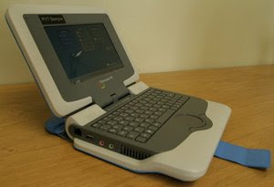

# Venezuela Egitim Icin 1 Milyon Laptop Aliyor
Venezuella hukumeti egitim amacli olarak 1 milyon ucuz laptopu Portekiz'den almaya karar verdi. Alinacak makinalar Intel'in tasarladigi Classmate PC tasarimini baz alacak ve makinalarda isletim sistemi olarak acik kaynak kodlu ve bedava Linux isletim sistemini kullanilacak. Aletlerin fiyatinin birkac yuz dolar civarinda olmasi bekleniyor.Classmate PC ve buna benzer ucuz laptoplarin uretimi, Her Cocuk Icin Bir Laptop (OLPC) hareketinin kendi tasarimini ortaya atmasiyla baslamisti. Bu tasarimin anonsunu burada yapmistik. Amac, artik bir kalem ve kagit kadar gerekli olan bilgi araclarinin egitim icin her cocuk  icin saglanmasini saglamakti. Kagit kalem paylasilmadigini gore, bilgisayar odalari uzerinden bilgisayarlar da paylasilmamaliydi. Egitimin buyuk kisminin okul disinda meydana geldiginden hareketle, egitim araclarinin eve tasinabilmesi ve her cocugun "benim" diyebilecegi, uzerinde oynayarak, "kurcayalarak" ogrenebilecegi, belki innovasyon yapabilecegi bir ortamin onlara saglanmasi amacini guden OLCP, sektorde guzel bir hareketlilik yaratmisa benziyor.

zaman:

Kasım 19, 2008

