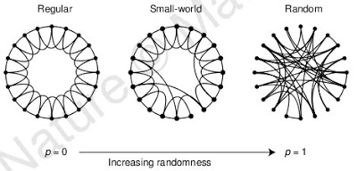

# Küçük Dünya Ağ Yapısı
Bir tanıdık ile konuşurken iki tarafın da tanıdığı ortak arkadaşların olduğunun ortaya çıkması bilinen bir olaydır. Ya da bir arkadaşınızın düzenlediği bir toplantıda, başka tanıdıklar ile karşılaşmak. Ortaklık ötesinde "tanıdıkların tanıdıklarını" kullanarak neredeyse herhangi bir ülke, sektör, meslek hakkında konuşabilir hale gelirsiniz. Bu durum konuşma dilinde "küçük dünya" diye betimlenen iyi bilinen bir fenomenin ortaya çıkmasıdır. Bu kavramın, tek bir alana mahsus bir raslantı olmaktan ziyade, küçük dünya ağ yapılarının doğanın kendini düzenlerken takip ettiği çok temel bir kanun olduğu son zamanlarda açıkça ortaya çıkmaya başlamıştır.  Küçük dünya yapılarının karakteristik özelliği, seçilen herhangi iki nokta arasındaki zıplama/bağlantı sayısının çok az, yani herhangi iki noktanın birbirine çok "yakın" olmasıdır. Bu bağlamda ortalama 3 ila 6 arası rakamlardan bahsedilir. Kıyasla her ağ yapısı bu özelliğe sahip değildir; Eğer insanlar sadece bir halka şeklinde ilişki kurabiliyor olsaydı, o zaman n kadar insanın potansiyel olarak bir diğerine n/2 mesafede olabildiği bir durum meydana çıkacaktı! Bu tabii ki çok büyük bir rakamdır ve verimsiz bir bağlantı yapısına işaret etmektedir.  Bağlantı mesafeleri hakkında yapılan popüler bir deney, Boston'daki bir kişiye posta ile paket ulaştırılması deneyidir. Deney için dünyanın dört bir yanındaki 160 alakasız kişiye bir paket teslim edilmiştir ve denekler, paketi posta ile ve yine dünyanın herhangi bir yerinde olabilecek kendi tanıdıklarına göndermek suretiyle final adrese erişmeye çalışacaklardır. Deneyin sonunda paketlerin ortalama 6 zıplama sonucunda adrese ulaştığı hesaplanmıştır. Bu durum "6 Derece Uzaklık (6 Değrees of Seperation)" sözü ile artık popüler kültüre dahil olmuştur. Dünyadaki herhangi birine ortalama altı basamak uzakta olduğumuz çok ilginç bir bulgu muhakkak. Demek ki insan ağları küçük dünya şeklinde organize olmuştur.  Küçük dünya yapısında olan ağların diğer bir karakteristiği, bu yapılardaki nodların bağlantı sayılarının dağılımı plot edildiğinde ortaya çıkmıştır; Sonuç "az sayıda çok bağlı", ve "çok sayıda az bağlı" bir görüntüdür. Sayısı az olan ama müthiş derecede bağlı "süper nodlar" mevcuttur, diğer nodların çoğunluğu az sayıda bağlanmış hafifsiklet nodlardır. Bu bağlantı yapısı, ne raslantıdır ki İnternet'in bağlantı yapısıyla tıpatıp aynıdır. Herhalde İnternet te "organik" bir şekilde büyüdüğü için bu yapının ortaya çıkması sürpriz olmamalı. Bu tür yapıların "çok sayıda az bağlı" yapısı yüzünden rasgele saldırılara karşı dayanıklı olduğunu belirtmiştik. Çünkü rasgele yapılan bir saldırı büyük ihtimalle network'un daha az önemli bir noduna denk gelecektir, bu sebeple network daha dayanıklı (robust) bir hale gelmiş olacaktır.  Bununla kalmıyor: Sınır yapısı biyologlar tarafından tamamen dekode edilmiş bir kürt (worm) tipi olan C. elegans'ın sınır yapısı yine tıpatıp İnternet'e benzemektedir! Bu sınır ağı da küçük dünya yapısındadır.  Burada tekrar eden bir kalıp ortaya çıkıyor: Küçük dünya ağlarının ortaya çıkmasında rasgeleliğin bir faktör olduğu açık. C. elegans, aynen insan vücudu gibi, milyonlarca yıllık evrimin bir sonucudur ve evrim rasgele mutasyonalara dayandığı için herhangi bir kötü mutasyonun en az "küçük dünya ağlarına" zarar vermesi akla yatkın olmalıdır. Bu sebeple doğal seleksiyonda küçük dünya yapıları daha başarılı olarak üste çıkmış ve günümüze kadar bu sayede erişmiş olmalıdırlar.  ----
 [1] Sync, Strogatz, S., 2003
 [2] Collective dynamics of small-world networks, Watts, Strogatz, Nature, 1998
 [3] Bağlantı dağılım grafiği bu blogda daha önce bahsettiğimiz "uzun kuyruklu dagilim" yapısının ta kendisidir. Demek ki eğlence tüketiminde de benzer kalıpları bulmak mümkündür.  [4] Halka şeklinde bağlı "normal" bir ağı, deterministik olarak küçük dünyaya çevirmenin algorıtması şudur: Her bağlantı teker teker gözden geçirilir her seferinde p olasılığında nodun bağlantısı koparılarak başka yine rasgele bir diğer noda bağlanır. Sabit p, 0 ile 1 arasındaki bir sayıdır, eğer p=1 ise ortaya çıkan tamamen rasgele (resimde sağda) bir yapıdır, ki bu küçük dünya değildir. p=0 ise tabii ki hiçbir şey değişmeden kalır. Resimde ortada görülen yapı, hem bağlılık hem de kümeleşme açısından en optimal olan küçük dünya yapısıdır.

zaman:

Aralık 16, 2008

