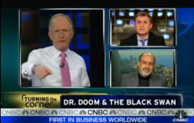

# Davos ve Kriz
2009 Davos toplantilarinda en ilgi ceken iki kisilik Roubini ve Nicholas Taleb olmus. Finansal krizi tahmin eden bu arkadaslar Davos'ta "rock star" ilgisi gormusler, guya. Bill Gates, Michael Dell filan konusma yapacaklari salonun onunde "sirada" beklemis.. Vay anasini! :) Taleb'i ve kitabi Siyah Kugu'ya burada pek cok kez referans vermistik. Roubini, Iran'li Yahudi, ama Israil ve Italya'da buyumus, tip Ortadogu nameleri caliyor Ingilizce'yi Italyan aksaniyla konusuyor. Tam bir kesmekes anlayacaginiz. Kuresel krize, kuresel doktor mu demek lazim? Taleb ayni sekilde, Beyrut'lu bir Hristiyan Arap ve ABD vatandasi.Soyleside Taleb'in vurguladigi bir konuya deginmek istedim; Borclardan kurtulma (deleveraging). Hem Roubini hem Taleb bankalar nasyonalize edilsin dediler. Tabii piyasalar "N kelimesi" telafuz edilince pek hosnut olmadi, ama, galiba fiili (de-facto) bir nasyonalizasyon olmaya basladi bile.Imdi; nereden cikti bu borclardan kurtulma isi? Daha onemli soru, bankalar niye borca batmis durumda? Aslinda FED'in 1913'te yaratilmasindan once bankalardaki hisse senedi turu yatirimlar (equity) oranlari %60'in uzerinde seyrediyordu. Bankalarin yuksek equity seviyelerinden dusuk equity seviyelerine dusmesinin sebebi devletin icat ettigi vergilendirme politikalariydi.  Devlet nerede cuvalladi? Hisse senet satislarindan gelen kazanca asiri vergi koydular, bir. Diger yandan bankalarin borclarini sirketin vergi bazindan dusmesini saglayarak borclanmayi tesvik etmis oldular, iki. Ayrica "son borc verici" olarak "merkez" bankalari bu trendi tesvik ettiler - finans operasyonlar icin kapital bulmak yerine borclanmak daha kolay geldi. Bu uc.Bunun ustune, Basel II regulasyonu yuzunden bankalarin egzotik, riski yuksek, ama potansiyel getirisi tatli turevsel finansal araclara yonelmesi geldi. Eger Basel II, ve, devletten fitili almis Frennie'nin kotu ornegi olmasaydi, bankalar buyuk bir ihtimalle bu zehirli araclara yonelmemis olacaklardi. Kuresel dengesizlikler yuzunden olusan ve ABD'ye hucum eden devasa para havuzundan bahsetmistik. O konuya bir daha girmeyelim. Orada ayrica petrodollar kavrami, ABD'nin dunyaya "biz dolar uretiriz, siz dolarin alabilecegi seyleri ureteceksiniz" gibi bir posta koyusu da var.Bugun Newsweek'in "Larry Summers'in Tekrar Egitimi" diye bir yazi patlattigini gordum - bastan sona felaket bir yaziydi. De Soto'nun yazisini da hic parlak bulmadim. Ne yalan soyleyelim; Millet dokuluyor. Foreign Policy dergisinde Moises Naim cok guzel yazdi - ekonomistler son krizde iyice karizmayi cizdirdiler, su kurtarma operasyonlari ise yararsa "birazcik" onurlarini kurtarmis olacaklar, ama o da ise yaramazsa tam battilar. Bunlar cok garip adamlar - bir kere tum akademiya icinde kendi alani "disina" en az referans veren arastirmacilar ekonomistlerdir. Yahu kardesim senin tum HAYATIN dis alanlar etrafinda donuyor. Nasil bakmazsin! Onu yapmazlar, sonra disaridan kendi alanlarina girenlere de kiziyorlar.

zaman:

Şubat 26, 2009

