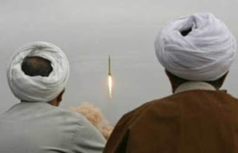

# Düşeş
2 Subat itibariyle mollalar uzayda... Afiyet olsun. Komsuyu kutluyoruz ve biz aynisini simdilik yapamadigimiz icin hayiflaniyoruz. Muhakkak Iran "izole" edildigi icin hem prestij hem bu izolasyonu kirma amacli olarak uzay arastirmalarina daha onem vermis (ayrica robot teknolojilerine de onem veriyorlar - robot projesi uzerinde ugrasanlarin askerlikten yirtma sansi var-), ama bu basariyi golgelememeli. Bravo diyoruz.Konu hakkinda ilginc bazi spekulasyonlar soyle: Iran roketi Omid'in uc seviyeli oldugu dusunuluyordu. Simdi roketin iki seviyeli oldugu tahmin ediliyor ve bunun onemli bir anlami var; New Scientist'te cikan bir yaziya gore  eger iki seviyeli roket dogru ise, Iran'in roket kabiliyeti zannedilenden daha ileride, cunku o zaman, Omid'in ikinci seviyedeki itis gucunun Iran'in sahip oldugu sanildigi teknolojinin cok ilerisinde oldugu ihtimali ortaya ckiyor. Eger bu dogruysa, bu teknolojiyi kullanarak 2021'de uzaya astronot gondermeleri mumkun olacak. Isi ulkelerin roket kabiliyetlerini analiz etmek olan MIT'ten Geoffrey Forden'in konu hakkindaki yazisi surada.Turkiye'ye gelirsek:Komsu hamle yapti. Her ne kadar hasmane bir iliskimiz olmasa da bizim armut toplamamiz olmaz. Basbakan gecende uzay arastirmalari hakkinda bir anons yapmisti. Simdi, Iran roketinin isiginda, buna ek olarak bizim nacizane talebimiz, Turkiye'nin ulasmak istedigi hedef hakkinda ortaya bir zaman cizelgesi (timetable) konulmasidir. Mesela "5 sene sonra TR uzaya uydu koyacaktir"... Ortaya bir zaman tablosu ve hedef koyuldugu zaman, onu gerceklestirmek icin ic kaynaklarin mobilizasyon ihtiyaci daha belirgin hale gelecektir.

zaman:

Şubat 10, 2009

