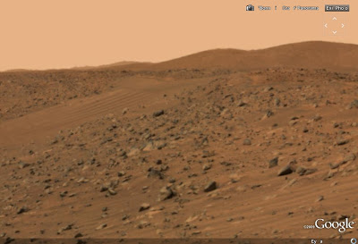

# Google Mars
Google Earth 5 surumu cikti ve bu son versiyonda Mars gezegeninden en son gelen fotograflar kullanilarak bir gezegen haritasi olusturulmus. Aynen GE ile dunyayi gezilir gibi artik Mars ta gezilebiliyor. Alttaki resim boyle bir gezinti sirasinda ekran ciktisi alarak kaydedildi.Manzaraya dalip gitmemek mumkun degil. Bakinirken insanin aklindan "bir canli var midir acaba... suradaki bir kafa miydi?" gibi dusunceler gecmiyor degil. :) Mars'i gezen robotlar Spirit ve Opportunity disli ciktilar, hedeflenen misyonlarini astilar, hala resim gondermeye devam ediyorlar. Bir belgesele gore robotlari hareket gezdirmek bayagi kulfetli bir is imis, tek bir gezinti icin sayfalarca program yaziliyor. Robotlar hala tam otonom degiller yani, yapay zeka arastirmalarindaki seviyemiz halen buna musait degil. Muhendislik secimi (engineering trade-off) denen sey burada ortaya cikar iste, muhendis kesfedilmemis olanla degil, eldeki ile isi bitirmeye ugrasir. Isi de bitirmisler evelallah. YZ arastirmalarina da camia tam gaz devam ediyor zaten.

zaman:

Şubat 02, 2009

