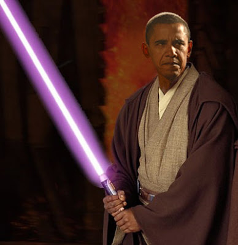

# Obama Baslangici
Obama yonetiminin baslangici nasil? Obama yapmak istediklerinin hepsini gerceklestirebilecek mi? Kurtarma paketi ne olacak? Obama bir Jedi gibi ortaya cikip herkesi kurtarip herseyi tamir edebilecek mi?Obama paketinin oncelikleri ucuncu dalgaya uyumlu. Hedefler egitim, saglik, bilim, temiz enerji, petrol bagimliligindan kurtulmak. Fakat Obama bu paketi ittirirken, bir yandan kabine atamalarinda iki basarisizlik yasadi. Boyle seyler olunca bir yonetim ABD siyasi tiyatrosunda politik sermaye kaybi yasiyor, ve diger yaptigin isler tehlikeye giriyor; cunku gecirmek istedigin kanuna destek verecek kongre uyeleri miziklamaya, kaytarmaya baslayabiliyorlar. Atamalardaki sallantilar sonrasi zaten Obama "cuvalladim (I screwed up)" demis, iste bu tur seyler adami zayif gosteriyor. Neyse bugun televizyona cikip, savasmaya baslamis, Amerikalilarin "degisime" oy verdigini, eski usullerin arkada birakilmasina coktan karar verildigini soyledi falan. Sureci sahiplenmeye basladi; kamuoyu uzerinden kongre uyelerini sIkIstiriyor bir yandan.ABD'de kongre ve hukumet ayri kutleler oldugu icin, baskan yeni kanular icin kongreye "rica etmek" zorundadir. Tabii kongrede kendi partisinden adamlar vardir, fakat bu kisiler degisik secim takviminde olduklari icin kamuoyu hissiyatina karsi hukumetten bagimsiz bir hassasiyetleri vardir. Halk ne dusunuyor? Halk nedzinde Obama kurtarma paketine karsi muthis bir istek gorunmuyor cunku Wall Street icin gecirilen paketin ise yaramadigi hakkinda bir algilayis var. Dogru ya da yanlis, algilayis boyle.Kriz zamaninda devlet mudahelesi mubah midir? Burasi gri bir alan... "ABD'yi burayi getiren yanlis devlet mudaheleleri olduguna gore, oradan cikaracak ta (bu sefer dogru?) devlet mudahelesidir, ama bu belli bir sistemi oturtmak icin yapilir, sonra karisilmaz" gibi bir yaklasim kabul edilebilir. Simdilik Obama'nin beni tek rahatsiz eden tarafi, bazen serbest piyasa ruhuna uymayan sozler sarfetmesi; Mesela "dayanisma" diyor, "yerli mali kullanalim" dedi ama bundan sonra cark etti [1]. Neyse ki kabinesinde saglam piyasacilar var (Summers, Clinton), bu iyi haber.--[1] Avrupa'dan da bu konuda itiraz geldi zaten. "Siz korumacilik yaparsaniz biz de yapariz" noktasina geliyor isler, yani "ticaret savasi (trade war)" olasiligi bas gosteriyor.

zaman:

Şubat 05, 2009

