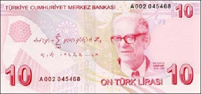

# Banknot Uzerinde Matematik
Yeni 10 liralik banknotlarin uzerinde Cahit Arf hocamizin resmi ve yaninda arastirmalarinda buldugu bir matematik formulu var. Topoloji alanindaki calismalarindan biri zannediyorum - invaryantlar ile alakali bulusu olmali. Banknot beni cok sevindirdi. Parasinin uzerine matematik formulleri koyabilen, bu sembolik eylemde bulanabilen bir ulkede olmaktan mutlu oldum.Cahit hocanin bu fotografini ceken meger Sabanci Uni. rektoru, matematikcilerimizden Tosun Terzioglu imis. Fotografin hikayesi Matematik Dunyasi dergisinde paylasiliyor. Bu arada MD, Ali Nesin'in yonettigi bir calismadir. Ona da buradan selam ve saygilar yollarim.

zaman:

Mart 03, 2009

