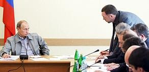

# Biat, Itaat
Putin bir fabrikatoru fircalamis, herkesin onunde imzalamak istemedigi bir belgeyi imzalatmis. Fabrikayi ziyaret edip "kizmis". Iste bu tam populizmdir. Bizde populizm genelde "subvansiyon" konusu ortada var ise gundeme cikar fakat populizmin daha genis bir tanimi var. Obama aylarca once benzer sekilde sirketlere "kizdiginda" bu populizm hissiyati ABD'de takir tukur guzelce analiz edildi. Populist, yani "halkci" kendini halkin tum ihtiyaclarina kendi basina karar verebilecek sekilde gorur, bu acidan bir tur kolektivist sayilabilir. Cozumleri mikro bireylerin toplami olan dinamige birakmaz, kendi halleder. ABD'deki tartismada isin evrimsel tarafina bile girdiler; efendim populist "genler" halki "kendisi gibi" gozetenlerdir ve bu alisveriste halk populiste ihtimam gosterir, ona bakar ve bu genler bu sayede bir sonraki nesle intikal eder. "Sinir" gosterisi ise herkese takip edilmesi gerekeni bildirmek icin bir mesajlasma aracidir.Demokrasilerde secilmis her politikacinin populizme biraz meyilinin olmasi normaldir, ne de olsa "halka", "cok olana" hitap ederek oraya gelmislerdir. Bu bir ikilem; her yigidin kendi yogurt yiyisi olacaktir. Obama'nin yaklasimi pek begenilmedi, o da bu yontemi takip etmeyi birakti.

zaman:

Haziran 07, 2009

