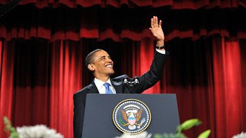

# Guzel Konusma
Obama Misir Kahire'de guzel bir konusma yapti. Kuran'dan bol bol alintilar yaparken tum dinlerin ortak noktasina vurgular yapti, ozgurluklerden bahsetti, kendi ulkesindeki muslumanlarin (ve tum diger dinlerin takipcilerinin) hayat bicimini yasamalarinda taninan ozgurluklerden ve bu ozgurluklere engellemeye calisanlara verilen cezalardan bahsetti. Turkiye'nin "Medeniyetler Ittifaki" cabasina vurgu yapmasi bu atilimin dis politikanin meyve vermeye basladigini gosteriyor.Obama musluman ulkelerine yonelik buyuk bir konusma yapacagini soylemisti; herhalde o konusma bu. Tum dinlerin ana mesajinin temel insan haklarinin soylemi ile ayni oldugu mesaji da olumluydu.Konusmanin tum metni.

zaman:

Haziran 04, 2009

