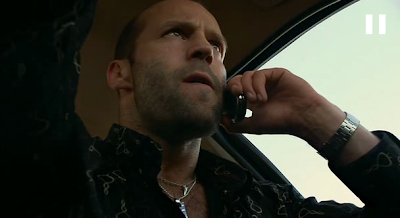
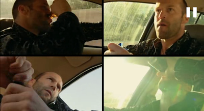

# Asiri Hiz
Hayat hizlaniyor. Etrafimizda surekli, ozellikle ekonomisi profosyonel is gucune dayanan ulkelerde gormek mumkun; islerini daha sIk degistiren insanlar, daha cok tasinma, daha cok evlenme, bosanma, ikinci, ucuncu, dorduncu kariyerler, diplomalar, girisimler. Tempo delice. Dogru durust bir duzen yok. Hersey corba.Toplum yapisi asagidan yukari dogru hizla cesitlenmekte, ABD gibi ulkeler hem aldiklari surekli goc ile hem de is yapis tarzlari cesitlenen bireylerin etkisiyle ilginc bir karisim halini almakta. Bu insanlarin tercihi yeni peydahlanan megapolis super sehirler ise artik neredeyse devlet boyutlarinda. Misir'da Kahire Misir'in ta kendisidir, icinde her turlu ekonomik duzeyi, iskolumu, yas, irk, dil grubunu barindirir.  Amerika'da Miami sehrinde Ingilizce ikinci dil haline gelmistir [1].Bu delice karisimi ve hizi beyaz perdede en guzel yansitan filmlerden biri Crank. Filmde Chev Cherios adli kiralik katil dusmanlari tarafindan bir ilacla zehirlenir, ki bu ilginc zehir, eger onu alan kisinin kalp atis ritmi duserse kisinin olmesine sebep olacaktir. Bu kurgu sadece filmin anlatmak istedigi hikaye ve takip edecek macera sahneleri icin bir bahane muhakkak; filmin geri kalaninda aksiyon rollerinden iyi bilinen aktor Jason Statham'in kalp temposunu arttirmak icin binbir numara yaptigini, sekilden sekle girip kendini garip ve komik durumlara dusurdugunu goruyorsunuz. Cherios ayni anda, olmemek icin muthis bir hizla Los Angales megapolisinde ilerlerken bize sehirde yatay bir kesit te gosteriyor. Ispanyol, Arap, beyaz, taksici, mafya, doktor, envai turden karakter ile Chev'in yolu kesisiyor. Cherios icinde oldugumuz delice tempolu hayatin, kurallari, duzeni yerine oturmamis bu corbanin bir kurbani. Sembolik olarak onun uzerinden kendi hayatimizin delice hizini anliyoruz. Fakat Cherios kurgusu oyle abartili ki bizim hizimiz muhakkak daha az gozukuyor, ve bu abartiya gulup belki kismen rahatliyoruz. Cherios bir kopekbaligi gibi, hareket etmezse olecek (kopekbaliklari solunum icin surekli hareket etmek zorundadir) seyirci en azindan bu tehdidi hissetmemektedir ve arkasina yaslanip Crank'in isledigi abartili kurguyu seyredip eglenebilir.--[1] Miami orneginde sunu da bilmek lazim; Bu sehir Kuba'dan kacan zenginlerin sigindigi ilk yerdi ve bu zengin kisiler Kuba'da harcayamadiklari tum parayi bu sehri insa etmek icin kullandilar. Sehri bu hale getiren onlarin sermayesidir. Ayni sebepten sehirde anti-Castro hissiyatlar oldukca gucludur, bu gocmenler yillarca bu sebeple Kuba'ya kendileri gibi sahin duran Cumhuriyetci adaylara oy vermislerdir (simdiki valileri Bush II'nin kardesi hatta  -Bush III !!-, Meksika'li hanimla evli,  Cumhuriyetci).

zaman:

Eylül 10, 2009

