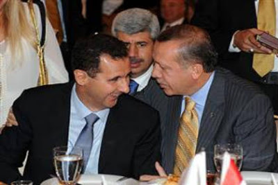
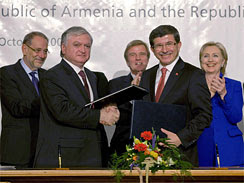
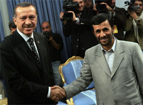

# Guzel Gelismeler
Dis politikada olumlu gelismeler oluyor; Turkiye / Suriye vize kaldirimi bir fiili birlesmeden baska bir sey degil, etki alanimiz genisliyor, kalici barisin gelmesi daha mumkun hale geliyor. Turkiye tutarli dis politikasinin meyvelerini toplamaya basladi, Ermenistan acilimi, Iran anlasmalari, hepsi cok olumlu. Emegi gecen herkesi kutlariz.

zaman:

Ekim 28, 2009

