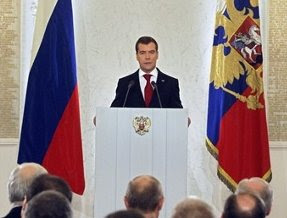

# Gorbacov'un Izindeyiz
Medvedev, ulkesinin hammadde ihracina olan bagliligindan kurtulmasi ve yeni bir hi-tech ekonomi kurmasi gerektigini soyledi. Medvedev ayrica devletin ekonomide yerinin azaltilmasi gerektigini ve sivil toplumun onemine vurgu yapti. Ulkesinin Sovyet zamanindaki endustriyel temeline dayanarak gelisemeyecegi yorumunu yapan baskan, ekonomik krizin Rusya'ya diger ulkelerden daha agir bir sekilde hasar verdigini soyledi.Medvedev bu sozleri ile Gorbacov'un sozlerini hatirlatti: "Ne yazik ki biz, icinde oldugumuz yeni enformasyon caginda en onemli varligin bilgi oldugunu farkeden en son ulkelerden biriyiz".

zaman:

Kasım 13, 2009

