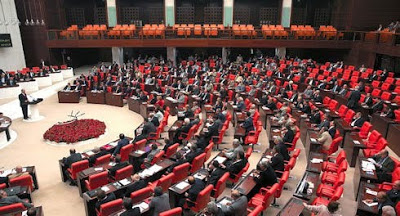

# Herkes Için Daha Fazla Ozgürlük
Besir Atalay meclis konusmasinda demokratik acilimin sloganini "herkes için daha fazla özgürlük" olarak anons etti. Iyi bir secim olmus.Konusmalar atesli gecti, fakat biz bu isin tiyatrosunu severiz. Ingiliz avam kamarasindaki "Basbakana Sorular" zamani da tartismalar, sesler, bazen laf atanlarla doludur. Tartisma, tartisilan konularin onemli oldugunu gosterir (stakes are high). Sonucta ulkeyi yonetmeye talip kisilerin biraraya gelip herkesin onunde argumanlarini dile getirmesi, fikir piyasasinda one gecmeye calisarak yarismalari, bazen birbirlerinden ogrenmeleri, fikir alisverisinde bulunmalari kadar guzel bir sey yok. Tabii ki (bize gore) yanlis soyleyen cok, kafasi ters tarafta olanlar bol. Fakat dogru konulari tartisiyoruz. Bu kesin.Dogru sozler telafuz edildi: Basbakandan "Şehitler gelsin de biraz bağıralım diyenler var", "insani insan oldugu icin seviyoruz", "25 yıl boyunca güvenlik sorunu ele aldığımız bu sorunda dağlar bombalandı mı, bombalandı, sınırötesi operasyon yapıldı mı, yapıldı. Sorun çözüldü mü?" sozleri gibi.Basarilar diliyoruz.

zaman:

Kasım 14, 2009

