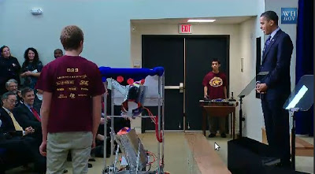
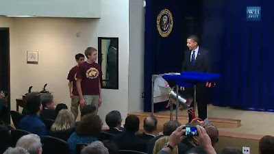

# Obama STEM Egitim Atilimi Konusmasi
Obama bilim, teknoloji, muhendislik, matematik (STEM) egitiminin yayilmasi icin genis bir atilim anons etti. Ozel sektor ile ortaklik edilerek surdurulecek atilimda, egitimde inovasyon tesvik ediliyor. Eforun parcasi olarak Obama, konusmasindan sonra icatlariyla birinciligi kazanmis iki ogrencinin yaptigi robotlu gosteriyi Beyaz Ev'de basin ile beraber seyretti. Detaylar [1, 2].

zaman:

Kasım 27, 2009

