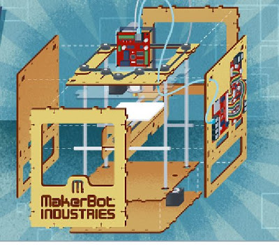

# Tektip Uretim Silinirken
3 boyutlu yazici (3D printer) teknolojisi gittikce gelisiyor. Makerbot Industries acik kaynak tasarimli bir yaziciyi tanitti. Ilginc bir durum: Baska bir cismi insa edecek araci kit olarak insa ediyorsunuz! Aslinda sirketin tasarimlarini herkese acmalarinin sebebi basit: Kullanicilar iyilestirmeleri geri onlara vererek urunu ilerletmelerini saglayabilir. Ayrica tasarim paylasiliyor ve tanim itibariyle o tasarimin parcalarini en iyi saglayacak olan sirketin ta kendisidir, bir diger yandan kullanici tasarimi gordugu icin daha ici rahat alim yapabiliyor. Tam bir kazan, kazan durumu.Isin aciklik boyutu bir yana, aletin yaptigi uretim tarafina gelirsek, fabrikalardaki endustriyel uretiminin kendisi de aslinda otomizasyon, talep boyutu yuzunden hizla degismekteydi. Urunlerin cizgisi (product line), yani ne kadar sure uretildikleri gittikce kisalmaktaydi, ve istege uygun uretim (customization) yayginlasmaya baslamisti (Dell ornegi burada ilginctir). Bu kitlesellikten, kisisellige dogru bir gidisattir, ve Internet dunyasinda vuku bulan ayni isimli surecte birebir karsiligi vardir.3 boyutlu basim ise, acikca soylemek gerekirse, tam bir "oyun degistirici (game changer)" gelisme.Ilgili yazi: Inovasyonu Outsource Etmek 

zaman:

Kasım 13, 2009

