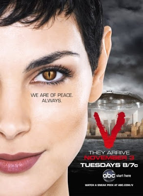

# V
Hazir uzayli temasindayken devam edelim; 80'li yillarin V (Visitors -Ziyaretciler-) dizisi tekrar tasarlandi (remake) ve yayina gecti. Iyi is yapmislar. Battlestar Galactica tekrar yapimi bir cuvallamaydi, ama V guzel olmus. Bilindigi gibi V dizisinde insana benzeyen uzaylilar dunyaya gelirler, fakat insan goruntusunun altinda bir surungen turu yaratiktirlar ve kotu 'emelleri' vardir. Eski V hafif bir Nazi rejimi alegorisiydi. Bu V apacik bir ABD Irak Isgali alegorisi yapiyor. Ziyaretciler ayri bir 'bolgede (uzay gemilerinde -yesil bolgede-) ikamet ediyorlar, oradan disari cikmak buyuk mesele, ayrica korsan metotlarla tum haberlesme agina hakimler, daha onceden zaten ajanlar ile dunyayi isgal etmisler, 'iyi amaclar' icin gelmis havasindalar (ABD icin 'size demokrasi getirecegiz', V durumunda bir suru baska sekerlemeler: herkese bedava saglik mesela -bu basli basina baska bir komedi, gundem gozonune alinirsa-). Espri tabii ki gercek hayatta 'isgal eden' Amerika'nin dizide 'isgal edilmis' olmasi (tum dunya ile beraber). Yeni V karakterleri Firefly, Stargate SG-1 dizisinden Morena Baccarin, Lost dizisinden Elizabeth Mitchell, 4400 dizisinden Joel Gretsch gibi bilim kurgu dunyasinda iyi bilinen isimler.

zaman:

Kasım 25, 2009

