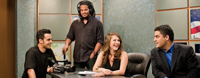

# The Young Turks

Adamımız Cenk Uygur, İnternet temelli televizyon programı The Young
Turks ile Fast Company dergisine konu oldu. TYT tam anlamıyla yeni
teknolojilerin, yeni ekonominin mümkün kıldığı bir oluşum. Program
sadece YouTube'da günde 450,000 izleyici çekiyor. Biz bu programa
nasıl rastgelmiştik? Google'daki arama seansları sırasında (bizim
nesil için düşünmek ile eşanlama gelmeye başladı), galiba jon türkler
ile alakalı bir şeyi ararken rasgele çıkmıştı... O günlerde OJ'in Las
Vegas'ta yakalanması olayı vardı, teyp kaydı çıkmıştı, Cenk OJ taklidi
yapıyordu: "Back against the wall m...f.cker. You stealin' my
shit?". Gülmekten yerlere yatmıştık. Eh politika da var, seyretmeye
başladık. Tüm fikirlere katılmasak ta, duruşları genel itibariyle
doğru.Karakterler ilginç; fotoğrafta görülen bayan Ermeni, diğeri
zenci, öteki ispanyol (hispanic). Salata kasesi.

