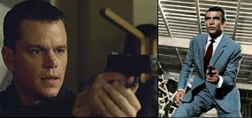

# Bourne vs. Bond
Jason Bourne hikayesi beyaz perdeye duser dusmez izleyenler bunun degisik bir ajan filmi oldugunun farkindaydi. Film klasik ajan hikayelerini temelden sarsti, oyle ki, aktor degisimi sonrasi "tekrar baslayan" Bond hikayesi Bourne filmlerini aynen taklit edecekti. Eger iki franchise'in arasindaki durusun farki filmlere bakilarak yeterince anlasilmadiysa, Bourne aktoru Matt Damon'un Bond hakkindaki su soyledikleri yeterli olacaktir: "Bond filmlerini hicbir zaman Bourne filmleri gibi yapamazlar, cunku Bond emperyalist bir psikopattir, her gittigi yerde bir kariyla yatar, martini bardagini sallar, ve insanlari oldurur. Itici, igrenc bir kisiliktir".Bu cekismenin muhakkak dalgalararasi bir anlami var. Tabii gizli ajan tiplemesinin sinemada on plana cikmasinda degisen hayat / is tarzinin payi var. Modern ajan para, arazi degil, bilgi pesindedir. Bu baglamda  Bond cagin ruhunu "kismen" takip eder.Fakat tum buna ragmen Bond bir  organizasyon adamidir. Merkezi bir "teskilatin" piyonudur.  Koca, ondan cok daha buyuk bir makinanin bir dislisidir sadece.Jason Bourne ise hafizasini kaybetmis eskiden militer / endustriyel yapinin icindeki, simdi tek basina olan bireydir. Bourne'un onceki kimligi olan Jason Webb bir askerdi. Militer / endustriyel kompleks tarafindan suikast ile gorevlendirilecekti fakat gorevi yerine getiremedi (hedefine acidi) ve gorevini terketti. Webb'in hafizasini kaybetmesi bir metafordur. Eskisi gibi olmak istemeyen, eskiden ne oldugunu hatirlamak istemeyen insanligin bir semboludur. Ingilizce "Bourne" kelimesi "born" kelimesi ile ses uyumlulugu oldugu icin secilmistir, born kelimesi ise  "yeni dogan" anlamina gelir. Modernite sonrasi insan gibi, Bourne'un  tekrar dogdugu benzerligi yapilmaktadir; ve tam da bu sebepten Bourne, bu yeni kisilik, artik sistemin bir dislisi degil, o ceberrut merkezi sistemin bir hedefidir.Klasik Bond hikayelerini hatirlayalim. Teskilat sefi M. karsisinda oturur, gorevini alir, her seyi ezbere "bilir". Bir sarap icer, tak diye ismini soyler, bir ulke hakkinda hemen "ezbere" bilgileri siralar.Bourne Google'a bakar.Bond aynen Matt Damon'un soyledigi gibi bir kiralik katil, gorevli bir hayduttur. Bourne ise hayatta kalmaya ugrasan, hayatin kaosu ile basetmeye calisan (oldukca becerikli) bir kisidir."Kabuk degisimine" ugradiktan sonra, Bond filmleri de Bourne'u taklit ederek daha karisan, kaos halindeki gunumuz hayatinin ruhuna uymaya ugrastilar. Mesela yeni reenkarnasyonunda Bond, "gorev disina" cikmaya basladi (hayatin yeni karisikligi merkezden idare edilemeyecek kadar cetrefil), takir takir beraber oldugu kadin gecidi yerine Bond'un ilk kez bir kadinla insan gibi beraber oldugunu gorduk, ama yine onun kontrolu disinda olaylar sonucu bu bayan olecekti.  Bond gorev basinda bile bir suru beklenmezlik ile karsi karsiya geldi, zehirlendi, neredeyse oluyordu, yakalandi vs.

zaman:

Ocak 08, 2010

