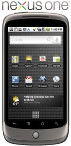

# Nexus One
Google'in kendi urettigi (HTC ile ortaklasa daha dogrusu) smartphone Nexus One piyasaya cikti. Boylece HTC Hero, Motorola Droid, G1 markalari altindaki icinde Android tasiyan mevcut donanim listesine Nexus One da eklenmis oldu. Suradaki yazida sektorun "duayeni" Tom O'Reilly'nin konu hakkindaki fikirlerini bulabilirsiniz. Bazi ozellikler:- Android Market entegrasyonu iyi yapilmis. Tek tiklama ile istediginiz uygulamayi satin almaniz mumkun.- Gmail baglantisi o kadar saglam ki insana laptopsuz olmayi dusunduruyoir.- Adres kitabi ve takvim guncelleme islemlerine gerek yok. Tum bilgiler hep en son hallerinde telefonda mevcut.

zaman:

Ocak 05, 2010

