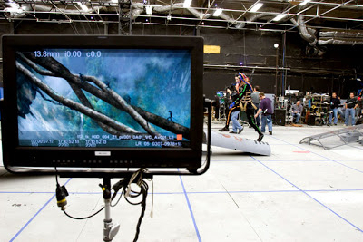

# Sanal Kamera
Avatar filminde kullanilan sanal kamera teknolojisi, eklemlenmis gerceklik tekniklerine bir ornek. Sanal kamera teknigiyle uzerinde elektronik isaretler tasiyan aktor, film seti icinde rolunu yapiyor, yuruyor, kosuyor, vs, fakat o aktorun setin uzerine sanal kamerayi tuttugunuzda, bilgisayar, gerekli grafikleri (CGI) 'aninda' o ham goruntu uzerine isleyerek ekliyor. Kameraman elle kamerayi istedigi gibi, sanki gercek kameraymis gibi tutabiliyor ve o sanal evrenin icinden istedigi kesiti, istedigi acidan seyirciye gosterebiliyor. Kamera serbest tutulabildigi icin CGI bazli filmlerde gorulebilen o yapaylik, hareketlerde tutukluk yok (Matrix II bile bu problemden mustaripti), eski usulde hareketler yeterince akici olmayabiliyordu, cunku cogunlukla CGI masa uzerinde oturan birinin mouse ile grafikleri eklemesiyle yapiliyordu, sanal kamera bu isi daha dogal gerceklestiriyor.Sinema dunyasinda guzel inovasyonlar oluyor, Matrix'in getirdigi "bullet time" yeniligine, simdi Cameron'un inovasyonlari eklendi.

zaman:

Ocak 04, 2010

