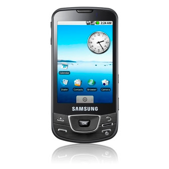

# Kullanışlı Android Programları
Android telefonlari yavas yavas kendilerini Turkiye'de gostermeye basladilar. Haberlere gore Teknosa'da General Mobile marka telefondan, Turkcell'in sattigi Samsung Galaxy'ye,  oradan bilgisayar magazalarinda ve diger "bilimum yerlerde" HTC Hero, vs. gibi pek cok secenek var. O zaman biz de Android telefonlar icin bazi faydali (ve bedava) programlari paylasalim:
 Twidroid: Twitter'a baglanmanizi, mesaj gonderebilmenizi saglayan bir program. Twitter icin en iyi Android uygulamasi.
 Weather Bug: Hava durumunu, birkac gunluk tahminleri gosteren bir program. Google Maps baglantisi var.
 Facebook App: Facebook'un kendi resmi uygulamasini kullanin, Bloo ve fBook iyi calismiyor.
 Foursquare: Lokasyonunuza gore etraftaki restoran, dukkan bilgilerini gosterir, daha onemlisi, o yerler hakkinda diger kullanicilarin o yerler hakkinda girdikleri bilgileri gosterebiliyor. Bu bilgileri siz de girebilirsiniz tabii ki. Not: Her Android telefonda GPS olmayabilir, ama aletinizin WiFi uzerinden yer bilgisi alma kabiliyeti var (cunku en azindan o Wifi baglantiyi veren Internet servis saglayicisinin hizmet ettigi gercek adres biliniyor).
 Bu liste yasayan bir liste olacak, ileride guncelleyecegiz.

zaman:

Şubat 03, 2010

