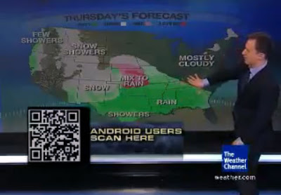

# QR Kodu
Cep telefonu uygulamalarinda iyi potansiyel var. Girdi olarak canli video, resim, ses, hareket, yon (pusula) gibi algilayicilarin oldugunu dusunursek, pek cok uygulama cesidi akla gelebilir. Alttaki uygulama barkod islemekten esinlenmis, telefonda lazer okuyucu yok, ama onun yerine yerine telefonun kamerasi uzerinden goruntu isleme algoritmalari ayni isi yapabiliyor. Resmin sol alt kosesindeki imaj "QR kodu"; kamerayi bu koda tutup, uygun isleyici programi telefonda isletince, goruntuden bu kodu alip, o kodun belirttigi islemler yapilabiliyor, bir program indirmek, bir kataloga bakmak, vs. Ornekte ABD Hava Durumu Kanali (Wheather Channel) ozel bir kod koymus ki telefonu kodu okuyunca kendi hava durumu programlari telefona indirilebilsin.  Barkod yanindaki mesaj "Android kullanicilari, burayi tarayin" diyor. Televizyondan telefona direk kablo, radyo, vs. baglanti olmamasina ragmen, QR kodu uzerinden sanki baglanti varmis gibi bilgi aktarmak mumkun olmakta... Baglanti.

zaman:

Şubat 04, 2010

