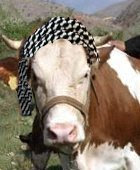

# Bölücü terorist yakalandı
Bir sure once ismi ayrilikci, soroscu ve bust karsiti eylemlere karisan Gulsum Inek, guneydogu'daki basarili bir operasyon sonucu kiskivrak yakalandi. Kod adi "otarsi" olan Gulsum, bust karsiti eylemi sonunda gonderildigi surgunden kacmisti. Guneydogu'daki bolucu gruplara katilan Gulsum, aylardir daglarda yasiyor. Yakalanmasiyla sonuclanan operasyonda 15 Heron, 70 Awacs ucagi, 42 helikopter ve 51 tane tank kullanildi. Gulsum, "aylardir dagda yiyecek ot bulamiyorum, bitap dustum, yorgunluktan kacamadim" sozlerini soyledi. Genelkurmay konu hakkinda "bunu soyleyecegini tahmin etmistik" yorumunu yapti.

zaman:

Haziran 21, 2010

