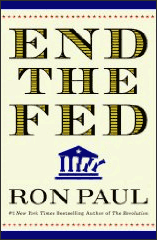

# Cay Partisi
Cay partileri ABD'nin kurulus tarihine bir atif, bilindigi gibi  bagimsizlik savasindan once Ingilizlerin vergilendirmesine bas kaldiran  Amerikalilar, Boston'da bir Ingiliz gemisinin getirdigi caylari denize  atmisti. Simdi benzer bir protesto yine (once) Boston'da, ama bu sefer asiri  borclanmayi, vergilendirmeyi protesto eden liberteryenler tarafindan yapiliyor. Hareket daha sonra tum Amerika'ya yayildi ve Cumhuriyetci Parti icinde kuvvetli bir damar haline geldi.Bu hareketin "ruhani lideri" Teksas'tan uzun yillar milletvekilligi yapmis olan Ron Paul. Paul ekonomide Avusturya okulunu takip etmesiyle biliniyor, ve merkezi kontrolun insanlarin hayatina her turlu mudahelesine karsi. Paul emlak temelli finans krizini yillar onceden dogru tahmin etmesiyle gundemde iyice one cikti. Sagda resmi gorulen kitabi "FED'i Bitirin (End the Fed)" ismini tasiyor. Cay Partisini cikis sebebi, ve duyarliliklari acisindan destekliyoruz. Daha once bahsettigimiz her iki partide bolup porcuk olan yeni cag gerekliliklerinin pesinde kosanlarin kipirtilari bunlar.Merkez'in yeni cagda belki de yapacagi en iyi icraat kendini gereksizlestirmek. Ulus-devletler surekli etraflarindaki sinirlari delerek kendilerini gereksizlestirmeli, altyapiya odaklanarak onun uzerinde daginik is yapilarinin, cozumlerin gidip gelebilmesini saglamali, Internet'ten elini ayagini cekerek halkin bilgilenmesine engel olusturmamali. Her yaptigi icraat, kendisini gereksiz hale getirmeli.Cay Partisi ozellikle "cokmesine izin verilmeyecek kadar buyuk sirketler" soylemine gicik. Bu soylem, hatirlanacagi uzere, buyuk finans sirketlerini kurtarmak icin kullanilmisti. Halki bu operasyona mecbur ettiler, ama simdi bedelini bu sekilde hareketlere gaz vermis olmakla oduyorlar. Buyuklugun verimlilik oldugunu zannetmek bir modernite hatasidir; bu baglamda da 3. dalga ile uyumlular.Ilgili yazi: Yeni Yeni Ekonomi

zaman:

Haziran 15, 2010

