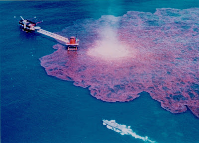

# Konsantre Enerji
Endustriyel Cag insanlari, parayi konstantre eder. Benzer sekilde,  enerji kaynaklari da konsantre haldedir. Gel gor ki, enerji kaynaklariniz konsantre, ufak bir alanda cok yogun sekilde duruyor ise, tek bir hata asiri buyuk bir alani kotu yonde etkileyebilir (nukleer enerji ayni problemden mustarip).Petrol uretiminde tepe noktasi hesabini buradan paylasmistik. Bu egri su ongoruyu modeller: ilk basta kolay petrol kuyularina erisilecektir, onlar bitince sira daha zor olan kuyulara gelecektir, ve o noktadan sonra uretim artisi yavaslamaya, ve sonra dusmeye baslayacaktir. BP kazasi bu modelde bir veri noktasi. Kolay kaynaklar azalmaya basladigi icin denizin derinliklerinden petrol cikarilmaya ugrasiliyor.O zaman pek cok yonden, endustriyel cag, modernite agir dayak yemektedir. Konsantre kaynaklari dogal (!) olarak azalmakta, onun yaninda risk fazlalastigi icin o ya da bu sekilde olacak kazalar kamuoyunu galeyana getirmekte. Ustune basarak soyleyelim; bu kaza bir felaket,  bir rezalettir, pek cok kisiyi son derece kizdirmistir. Gelecekte misilleme ekoterorizm olaylarinin olmasi bile muhtemeldir.Olay sonrasi Obama'nin sahilde basina verdigi goruntu ise tam bir zavallilik ornegiydi. Kendileri de cokmekte olan medeniyetin temsilcileri "merkezi" yonetimlerin olaylar karsisinda ne kadar caresiz oldugunu bir kere daha gormus olduk. Bazi Amerikalilar (ozellikle devletci sol) Obama'yi elestiriyor, fakat onun da mevcut sistem icinde yapacak bir seyi yok. Su anda Vatandas Kevin Costner, baskan Obama'dan daha faydali.3. dalgaya uyumlu olan "daginik (distributed)", bireysel, temiz enerji uretimidir. Bu uretim gunes, biyo/tarimsal, ruzgar seklini alabilir. Elektrik dagitim agi oncelikle alternatif akimli (ac/dc) elektrikten [1] duz (dc) temele gecirilmelidir, bu sayede enerji kaybi azaltilabilir... Akilli enerji dagitim agi, insanlarin enerji tuketicisi oldugu gibi urettigi enerjiyi hatta geri satabildigi bir secenektir, bu da takip edilebilir.Elektrikli ulasim simdiden gundemde. Better Place yaklasimi Isvec, Danimarka, Israil gibi ulkelerde  test ediliyor, ve gelecegi var.---[1] Dagitim aginiz alternatif akim temelli ise, faz degisimi, elektrik ureten jeneratorlerin donusu ile "tami tamina" senkronize olmak zorunda. Sistemdeki tum ureticiler birbiriyle, ayni sekilde. Bu durumda sistemdeki enerji, o anda ya kullaniliyor, ya da bosa gidiyor. Uretim / tuketim "aninda" uyum halinde olmali, ve bu pek verimli bir sistem degil. DC temelli hatlarda depolama, aktarma isleri daha kolay.

zaman:

Haziran 15, 2010

