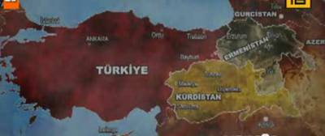
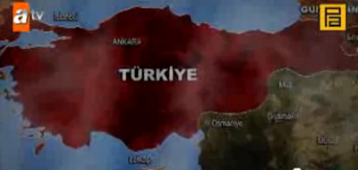
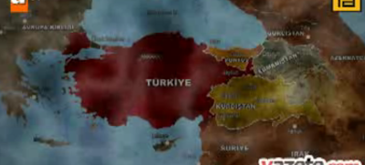
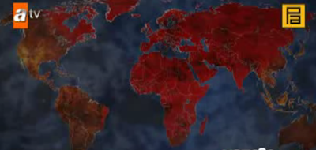

# AB/D, Pontus, Komplo, Kurtlar Vadisi
Zontalarin, Romaci, merkeziyetci kabadayi zavallilarin dizisi Kurtlar Vadisi icin bir reklam yapmislar, YouTube'da geziniyor (bu siteyi yasakladigini zannedenlere arz ederim).Adamlarin koylu, toprak bazli dunya gorusu "toprak kaybetmemek, toprak kazanmak" oldugu icin toprak uzerine korkunc senaryolar yapiliyor dogal olarak.Ilk senaryo ABD'nin Turkiye emelleri:Ikinci senaryo Israil'in emelleri:Ucuncu senaryo AB'nin emelleri (Istanbul ozerk bolgesine dikkatinizi cekerim):Ve en son, Turkiye'nin emelleri.Tabii isgalci, yagmaci mantiga uygun olarak tum dunya fethediliyor. Fakat benim anlayamadigim Amerika'yi niye kutuplardan fethediyor. Yani orada t..klarin donacak kardesim.. Niye ta tepeden iniyorsun?Fasistin en babasi bile iklime yenilmis, senin gibi ufak, ikinci derece davarlara  ne oluyor?Bu milliyetciler hakikaten cok gerizekali oluyorlar...YouTube Video

zaman:

Eylül 07, 2010

