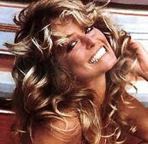
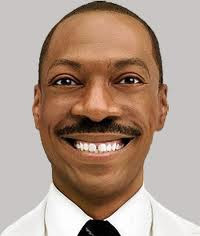
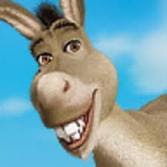

# Sırıtış
Farah Fawcett posterini gorunce aklimiza geldi; o poster  70'li yillarin simgesi haline gelmisti... O "sırıtış" sonra 80'lerde de kendini gosterdi, bu sefer Eddie Murphy'nin yuzunde. Tabii gulumseme yetmiyordu o zamanlarda, boyle at gibi guleceksin. Butun disleri gostererek. Eh 70/80'ler ne de olsa "plastik" bir cagdi, plastik ifadeler, plastik suratlar.Eddie Murphy deyince, en sagdaki resim Shrek animasyon filmindeki esek karakteridir, ve seslendirmesini Murphy yapiyor; Hemen ona da pat diye Murphy'nin sırıtışını vermisler. Alem adamlar bunlar... Holywood boyledir, hicveder, sonra hicvettigini hicveder, boyle devam eder.

zaman:

Ekim 20, 2010

