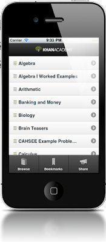

# KhanApp
Youtube uzerinden matematik, bilim dersleri veren Khanacademy video icerigi icin bir tablet, telefon uygulamasi (app) yazmis. App olacaksa boyle olmali, Khanacademy video icerigi hala acik olmaya devam ediyor,  app uzerinden daha kolaylasiyor / bir kanala daha kavusuyor, paylasilabiliyor.Bu tur uygulamalar ve genelde teknolojilerin yayilmasi, daha once belirttigimiz gibi eskinin yokolmasi anlamina gelecek. KhanApp bir ogretmenin yerine gecebilir. Tahta basinda, bir sinifa tikilarak ayni anda (senkron) ogretme / ogrenme gittikce daha cagdisi gozukmeye basliyor. KhanApp'in icerigi mevcut ogretmenlerin yuzde 99'undan daha kaliteli, yuzde 100'unden daha hazir ve nazir olduguna gore, bu rekabetin eskinin lehine gelismeyecegi anlasilir.Moderniteye bir darbe daha inmistir. Darbe yiyen kavramlar hangileri? Senkronizasyon, ayni anda ayni yerde olmaya gerek yok. Konsantrasyon, insanlarin tek yere tikilmasi gerekmiyor. Merkezilestirme ve standardizasyon, merkez tarafindan tanimli standart bir mufredatin takip edilmesi gereksiz hale geliyor.Not: KhanApp yeni bir Internet teknolojisi olan HTML5 ile yazilmis, bu teknoloji tarayici kavrami uzerinden calisiyor, platform bagimsizligi var, bu sebeple hem Android, hem iPhone/iPad uzerinde calisabiliyor. "Platforma ozel" kod yazmaya gerek yok. Gelistiriciler icin bu tur seyler onemli.

zaman:

Ocak 04, 2011

