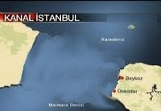

# Secilen yer düsündürücü

Etiler kose yazarlari dernegi KanalIstanbul projesi icin secilen yerin
dusundurucu oldugu yorumunu yapti. Dernek projenin asil amacinin su
anda Istanbul'un Avrupa yakasinda oturanlari "Avrupa'dan kopartmak"
oldugunu ileri suruyor. Dernekteki kose yazarlari "kanal acildiktan
sonra biz kendimize ne diyecegiz? Avrupali mi olacagiz, yoksa Asyali
mi olacagiz? Bir arada bir derede bir sey mi olacagiz" yorumunu
yapti. Sozcu daha simdiden kimlik bunalimi yasadiklarini
soyledi. Fakat blog'umuz bir habercilik basarisina daha imza atarak,
aslinda cok daha derin bir komplo oldugunu ortaya cikardi. Projenin
Rusya ile baglantilari var. Kanal sayesinde Istanbul parcalanacak ve
ortadaki parca Putin'e satilacak. Bu parca uzerindeki insanlarla
beraber tamamen Rusya'ya gonderilecek, boylece Rusya'nin nufus
problemi cozuluyor ve ayni anda Istanbul'a goc problemi hallediliyor,
milyonlarca insan Istanbul'dan disari goc ettirilmis oluyor.Ayrica
satim sonrasi ortaya cikan buyuk bosluk sayesinde Marmara Denizi
tabirine gerek kalmiyor, Marmara Denizi bundan sonra Karadeniz
oluyor. Bu komplonun AGaPe uzerinde cok etkili olan Rize, Giresun
lobileri ile baglantisinin oldugu bildirildi.

