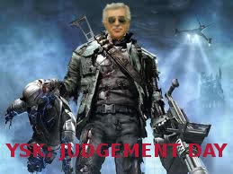

# Yeni film vizyonda

Sinemalarda vizyona giren YSK: Judgement Day (Yargilama Gunu) filmi
seyircilerle bulustu. Film Terminator serisinden alinti yaparak yeni
bir kurgu olusturuyor.  Terminator serisinde Skynet adli bilgisayar
programi bilinc kazaniyor ve dunyayi ele gecirmeye calisiyordu. YSK:
Yargilama Gunu filminde devlet kurumlarindan biri olan YSK bilinc
kazaniyor ve Turkiye'yi ele gecirmeye ugrasiyor. Kurum insana benzeyen
robotlar insa ederek, onlari zamanda geriye gonderir ve secim
sonuclarini bozmaya calisir. Insana benzeyen yokedici robotu bu filmde
Ali Em oynadi; orijinal filmde John Connor'un pesinde olan yokedici
robot bu filmde Hatip Dicle'yi kovaliyor.

zaman:

Haziran 29, 2011

