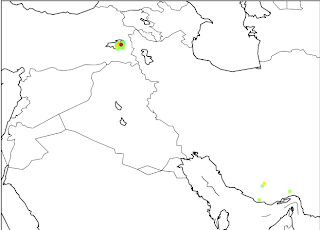
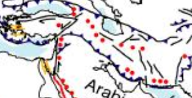

# Van
USGS deprem verilerine gore son bir hafta icinde Turkiye'nin etrafinda Richter olcegide 1 uzeri olan depremler sadece guney Iran'da. Ekim 19,20 ve 23'unde orasi da "titremis". Nukleer test mi yapiliyor nedir?  2008 yilinda Iran'da Richter 5 civari sarsintilarin  nukleer test oldugu iddia edilmisti. Neyse komsuyu daha fazla somut bilgi olmadan suclamayalim, veriler altta (kolonlar sirasiyla siddet, derinlik, zaman, bolge)7.2 20.00 Sunday, October 23, 2011 10:41:21 UTC eastern Turkey4.3 10.00 Sunday, October 23, 2011 00:31:19 UTC southern Iran4.5 10.00 Thursday, October 20, 2011 06:57:25 UTC southern Iran5.2 7.00 Wednesday, October 19, 2011 02:52:44 UTC southern Iran4.5 38.90 Wednesday, October 19, 2011 00:58:07 UTC southern IranHarita uzerinde tum 1 haftalik veriyi grafikleyince soyle cikiyorFay hatlari haritalarinda guney Iran ve Turkiye'nin dogusunu baglayan bir hat gozukuyor.Paylasalim dedik.

zaman:

Ekim 25, 2011

