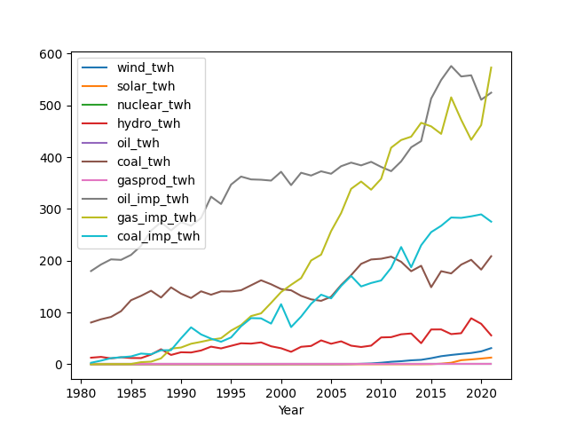
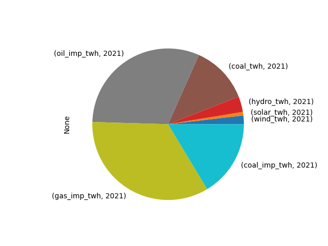

# Enerji İstatistikleri

```python
import pandas as pd
pd.set_option('display.max_columns', None)
fin = '../../../en/2019/05/bp-stats-review-2022-consolidated-dataset-panel-format.csv'
df = pd.read_csv(fin)
df = df[df.Country == 'Turkey']
df = df.set_index('Year')
df = df[df.index > 1980]
df = df[['wind_twh','solar_twh','oilprod_kbd','nuclear_twh','hydro_twh','gasprod_ej','coalprod_ej','gascons_ej','oilcons_ej']]
df['oil_twh'] = df.oilprod_kbd * 365 * 1700 * 1000 / 1e9
df['coal_twh'] = df.coalprod_ej * 277.778 
df['gasprod_twh'] = df.gasprod_ej * 277.778
df['gascons_twh'] = df.gascons_ej * 277.778
df['oil_cons_twh'] = df.oilcons_ej * 277.778
cols = [x for x in df.columns if '_twh' in x]
df = df[cols].fillna(0)
df[cols].plot()
plt.savefig('energy-sources.png')
print (df[cols].tail(3))
```

```text
       wind_twh  solar_twh  nuclear_twh  hydro_twh  oil_twh    coal_twh  \
Year                                                                      
2019  21.730700   9.249800          0.0  88.822800      0.0  201.773096   
2020  24.828200  10.950200          0.0  78.094300      0.0  182.830358   
2021  31.137427  12.833868          0.0  55.695232      0.0  208.643868   

      gasprod_twh  gascons_twh  oil_cons_twh  
Year                                          
2019          0.0   433.613797    558.265075  
2020          0.0   462.099445    511.008829  
2021          0.0   573.235049    524.657636  
```




```python
df2 = df[cols].tail(1).unstack()
df2 = (df2 / df2.sum())*100.0
df2 = df2.dropna()
df2.plot(kind="pie")
plt.savefig('source-pie.png')
df2
```

```text
Out[1]: 
              Year
wind_twh      2021     2.214291
solar_twh     2021     0.912661
nuclear_twh   2021     0.000000
hydro_twh     2021     3.960682
oil_twh       2021     0.000000
coal_twh      2021    14.837392
gasprod_twh   2021     0.000000
gascons_twh   2021    40.764741
oil_cons_twh  2021    37.310232
dtype: float64
```




