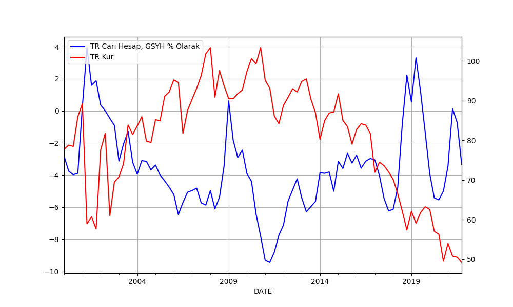
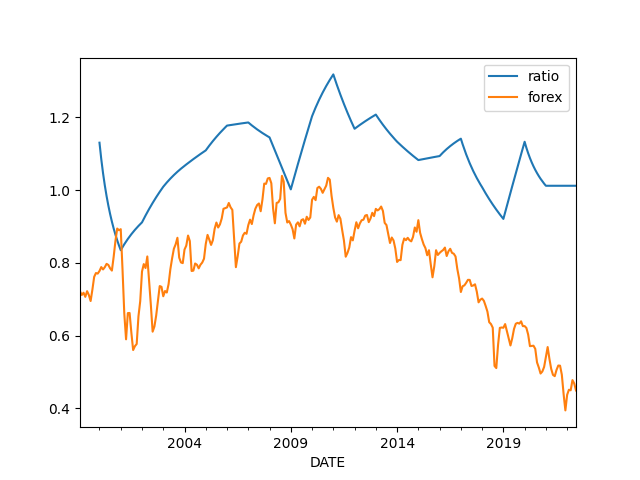
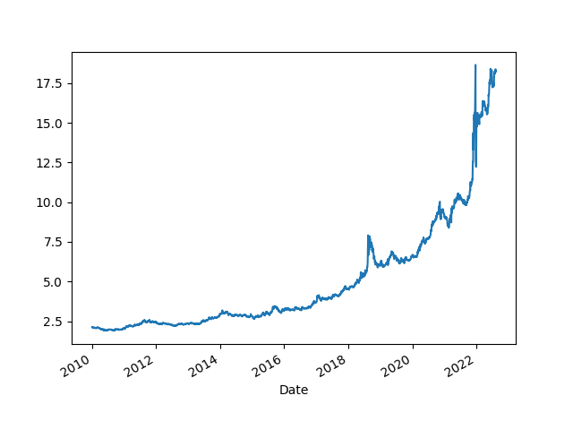

# Ekonomik İstatistikler

Cari acik ile kur iliskisi

```python
from pandas_datareader import data
import datetime

today = datetime.datetime.now()
start=datetime.datetime(2000, 1, 1)
end=datetime.datetime(today.year, today.month, today.day)
cols = ['TURB6BLTT02STSAQ','RBTRBIS']
df = data.DataReader(cols, 'fred', start, end)
df = df.dropna()
print (df.tail(5))
plt.figure(figsize=(10,6))
ax1 = df.TURB6BLTT02STSAQ.plot(color='blue', grid=True, label='TR Cari Hesap, GSYH % Olarak')
ax2 = df.RBTRBIS.plot(color='red', grid=True, secondary_y=True, label='TR Kur')
h1, l1 = ax1.get_legend_handles_labels()
h2, l2 = ax2.get_legend_handles_labels()
plt.legend(h1+h2, l1+l2, loc=2)
plt.savefig('currxch.png')
```

```text
            TURB6BLTT02STSAQ  RBTRBIS
DATE                                 
2020-04-01         -5.612587    57.08
2020-07-01         -5.655827    56.34
2020-10-01         -5.281476    49.55
2021-01-01         -3.262093    54.04
2021-04-01          0.239925    50.84
```



Ithalat Ihracat Orani ve Kur

```python
from pandas_datareader import data
import datetime

def get_fred(year, series):
    today = datetime.datetime.now()
    start=datetime.datetime(1970, 1, 1)
    end=datetime.datetime(today.year, today.month, today.day)
    df = data.DataReader(series, 'fred', start, end)
    return df

df = get_fred(1990, ['TURIMPORTADSMEI','TUREXPORTADSMEI','RBTRBIS'])
df = df[df.index > '1999-01-01']
df.columns = ['import','export','forex']
df = df.interpolate()
df['ratio'] = df['import'] / df['export']
df['forex'] = (df.forex / 100.0)
df[['ratio','forex']].plot()
plt.savefig('impexp.png')




Dollar / TL

```python
import pandas as pd, datetime, time as timelib
import urllib.request as urllib2, io
end = datetime.datetime.now()
start=datetime.datetime(2000, 1, 1)
start = int(timelib.mktime(start.timetuple()))
end = int(timelib.mktime(end.timetuple()))
base_fin_url = "https://query1.finance.yahoo.com/v7/finance/download"
url = base_fin_url + "/USDTRY=X?period1=" + str(start) + "&period2=" + str(end) + "&interval=1d&events=history&includeAdjustedClose=true"
r = urllib2.urlopen(url).read()
file = io.BytesIO(r)
df = pd.read_csv(file,index_col='Date',parse_dates=True)['Adj Close']
plt.plot(df.tail(1).index, df.tail(1),'ro')
df.plot()
print (df.tail(5))
plt.savefig('try-dollar.png')
```

```text
Date
2021-12-13    13.85489
2021-12-14    13.80329
2021-12-15    14.37780
2021-12-16    14.81410
2021-12-17    15.66075
Name: Adj Close, dtype: float64
```


Euro / TL

```python
import pandas as pd, datetime, time as timelib
import urllib.request as urllib2, io
end = datetime.datetime.now()
start=datetime.datetime(2000, 1, 1)
start = int(timelib.mktime(start.timetuple()))
end = int(timelib.mktime(end.timetuple()))
base_fin_url = "https://query1.finance.yahoo.com/v7/finance/download"
url = base_fin_url + "/EURTRY=X?period1=" + str(start) + "&period2=" + str(end) + "&interval=1d&events=history&includeAdjustedClose=true"
r = urllib2.urlopen(url).read()
file = io.BytesIO(r)
df = pd.read_csv(file,index_col='Date',parse_dates=True)['Adj Close']
plt.plot(df.tail(1).index, df.tail(1),'ro')
df.plot()
print (df.tail(5))
plt.savefig('try-eur.png')
```

```text
Date
2021-12-13    15.667590
2021-12-14    15.574390
2021-12-15    16.167730
2021-12-16    16.693090
2021-12-17    17.732321
Name: Adj Close, dtype: float64
```




