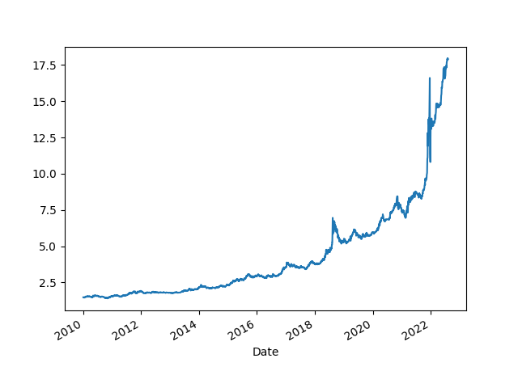

# Ekonomik İstatistikler

Cari acik ile kur iliskisi

```python
from pandas_datareader import data
import datetime

today = datetime.datetime.now()
start=datetime.datetime(2000, 1, 1)
end=datetime.datetime(today.year, today.month, today.day)
cols = ['TURB6BLTT02STSAQ','RBTRBIS']
df = data.DataReader(cols, 'fred', start, end)
df = df.dropna()
plt.figure(figsize=(10,6))
ax1 = df.TURB6BLTT02STSAQ.plot(color='blue', grid=True, label='TR Cari Hesap, GSYH % Olarak')
ax2 = df.RBTRBIS.plot(color='red', grid=True, secondary_y=True, label='TR Kur')
h1, l1 = ax1.get_legend_handles_labels()
h2, l2 = ax2.get_legend_handles_labels()
plt.legend(h1+h2, l1+l2, loc=2)
plt.savefig('currxch.png')
```


Dollar / TL

```python
import pandas as pd, datetime, time as timelib
import urllib.request as urllib2, io
end = datetime.datetime.now()
start=datetime.datetime(2000, 1, 1)
start = int(timelib.mktime(start.timetuple()))
end = int(timelib.mktime(end.timetuple()))
base_fin_url = "https://query1.finance.yahoo.com/v7/finance/download"
url = base_fin_url + "/USDTRY=X?period1=" + str(start) + "&period2=" + str(end) + "&interval=1d&events=history&includeAdjustedClose=true"
r = urllib2.urlopen(url).read()
file = io.BytesIO(r)
df = pd.read_csv(file,index_col='Date',parse_dates=True)['Adj Close']
df.plot()
print (df.tail(5))
plt.savefig('try-dollar.png')
```

```text
Date
2021-12-02    13.44320
2021-12-03    13.71710
2021-12-06    13.63205
2021-12-07    13.78315
2021-12-08    13.68880
Name: Adj Close, dtype: float64
```




