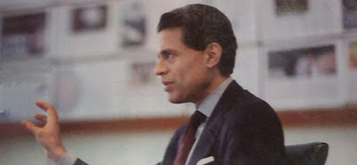

# Hafta 32

Suleyman Yasar

Siyasetçi nasıl halkla inatlaşamazsa, işadamları da ekonomiyle
inatlaşamaz. [..] Peki o zaman niye TÜSİAD referandumda evet demeyerek
bütün bu hukuk dışılıkların sürmesini istiyor?  Çünkü TÜSİAD, Anadolu
sermayesinin sadece İstanbul'un ürettiklerinin "bayisi, acentesi"
olmasına razı oluyor. [..] TÜSİAD, piyasaya, büyük sermayenin
ürünlerinin dışında yeni ürünlerin girmesini istemiyor. Kendisine
rakip mal üreten Anadolu sermayesinin yatırımlarını yok etmek
istiyor. Hatırlanacaktır, Anadolulu pek çok işadamının fabrikası,
İstanbul'un büyüklerine rakip oldukları için devletin gücü
kullanılarak kapatılmıştı. Ama artık TÜSİAD Anadolu'yu
engelleyemiyor. Çünkü siyasiler, TÜSİAD'ın isteklerini artık eskisi
gibi gözü kapalı yerine getirmiyorlar.

Dogru

---

Mehmet Altan

İslam medeniyetinin altın çağını yaşadığı 7. ile 17. yüzyıl arası [..]

Yanlis

İslam medeniyetinin altın çağı, 8. ve 13. yuzyil arasidir.

---

Bir Kemalist

AKP oy almak icin komur dagitiyor

Bize has degil

Oy karsiligi para, projeleri bir bolgeye, o bolgenin temsilcisine
vermek, ABD'de "pork barrel spending" deyimiyle biliniyor. Bir meclis
uyesinin herhangi bir kanunda desteginin alinabilmesi icin bazen bu
tur "sekerlemelerin" o kanuna dahil edilmesi Washington'da anormal bir
olay olarak gorulmez. Gecende vefat eden Senator Robert Byrd mesela,
bu isi o kadar iyi yapiyordu ki, adi "king of pork"'a
cikmisti. Byrd'un eyaletine yonlendirdigi harcamalarin 1 milyar dolari
astigi soylenmektedir.

Tabii bu tur sekerlemelerin halka direk verilmesi bazilarina itici
geliyor olabilir, zaten ABD'deki pork barrel soylemi de genelde itici
bir cercevede telafuz edilir. Fakat onemli nokta, demokratik sistem
icinde bunlarin imkansiz, inanilmaz seyler olmadigidir -- hatta
kimilerine gore yapilan demokrasinin ana islevlerindendir.

Yani bunlarin hepsi kendi basina tartisilabilir, fakat su veriliyor,
bu veriliyor, bunlar baska hicbir yerde olmuyor, "bize has" soylemi
kesinlikle dogru bir soylem degil.

---

Fareed Zakaria

Petrol sizintisina cevabimiz bir rezaletti, burada biz derken
ulkemizden degil, medyanin cevabindan bahsediyorum. Dunyanin en buyuk
felaketlerinden biri olurken medyadaki yorumcular "Obama'nin
televizyonda duygu gosterisi yapmasini" soyluyorlardi. [..] New York
Times kose yazarlari Obama'yi "kizgin" gormek istediklerini
soylediler, [film yapimcisi] Spike Lee Obama'nin "kufur edip, etrafina
saydirmaya baslamasini" istedi, Demokrat James Carville baskani
"tepesi atmis" halde gormek istedigini belirtti. [..]Biz aklimizi mi
yitirdik? Onumuzde muthis muhendislik zorluklari var: deligi tikamak,
petrolu sudan ayirmak, korfezi eski haline getirmek. Ama yok, biz
teknik elemanlara danismayi falan bosverelim. Oyle seyleri inek
cocuklar yapar. Biz savas boyalarini surelim, ve birilerinin guzelce
tozunu alalim.

Aferim len

Arada sirada kafan calisiyor Ferit. Yanliz Newsweek Enternasyonel'de
gecende bir resmini gordum, boyle artiz pozlar verilmis... Acaip bir
el hareketi.. Bu ne hareket boyle.. Indir o elini! Indir!:)

---

Aykırı

Su Newsweek Turkiye yazisinda "civil engineer (insaat muhendisi)"
kelimeleri niye "toplum muhendisi" diye tercume edilmis?

Cakallik seziyorum

Civil engineer kelimesinden toplum muhendisine gecis yapmak zor
istir.. Bunun icin ugrasmak gerekir. Acaba dergi sahibinin insaat
isinde olmasindan dolayi mi boyle bir gecis yapildi? Ferit Zekeriya:
uyuyor musunuz?  Bakin adaminiz bile bile YALAN YAZIYOR. Birilerinin
kulagini cekin.[alttakiler birlestirme]

Refik Erduran

Cennet gibi bir ortamın sefasını sürerken "Ah, şimdi falan yerde olmak
vardı" diye sızıldanır ya da başka zaman dilimlerinde yaşamaya
özeniriz. Bu ikincisi en çok yaşlıların "Eskiden falan şey şöyle
iyiydi, böyle güzeldi" sözleriyle başlayan nostalji kıtırları
biçiminde gelir gündeme.

Bize has degil

Yazinin geri kalaninda bakilinca tarif edilen durum Turkiyelilere has
bir durummus anlami cikiyor. Bu dogru degildir. Eskiye olan romantik
bir dingillik diger milletlerde de mevcuttur. Fikra soyledir: Bir
ampulu takmak icin kac Ingiliz gerekir?  Cevap 5 tane. Biri ampulu
takar, diger dordu eskisini nasil daha iyi oldugu hakkinda
yakinir.

Turkiye'de gecmise verilen kultur kodu GUZEL GUNLER (dilimizde okkali
bir kufrun "gecmisini s.keyim" olmasi raslanti olmasa gerek).Kodlar
bir tarafa, gecmis tabii ki bugunde kullanilabilirlik acisindan,
dogrular ve yanlislar ile doludur, muhakkak bazi kulturler
digerlerinden daha sansizdir ve Turkiye Osmanli / Roma mirasi
sebebiyle nispeten sansizlar kolonundadir. Ama Avrupa'ya olan cografi
yakinlik, kultur geciskenligi, adapte olabilme ozellikleri, yani
kodlarin bugune gore "iyi" olan taraflari isleri kurtariyor. Bu dogru
kodlar evrimsel bir surecte odullenip yeni nesillere
tasinacaklar.

Cengiz Han[Savasta Selcuklu Turklerinin kafasini kirarken]

Beni gunahlarinizin cezasini vermem icin Allah gonderdi.

Belki

Isin Allah kismi kesin degil muhakkak, fakat Han'in bir seylerin
cezasi oldugu kesin. Tarihciler, sosyologlar; Cengiz Han'in isgal
ettigi ulkelerin yonetiminde despotlugun artmasinda bir korelasyon var
mi, yok mu, bir arastirin (bir ise yarayin); Beyaz Ruslar, Turkler,
Araplar bu isgale maruz olmustur. Asyali erkeklerin yuzde onunun
Cengiz Han'in soyundan geldigini burada belirtirim ve saygilar
sunarim. Bunun anlami hakkinda biraz "beyin firtinasi" yapin
bakalim.

Bir akademisyen

Gecmiste olmayan milletler bugun olamazlar

Yanlis

Bugun olanlar bir sekilde gecmiste nasilsa olmustur. Bu olusun "ne
kadar guzel" oldugu hakkinda trasa gerek yoktur.

Bir yabanci yazar

Serbest piyasa koktencileri [..]

Kelimelere dikkat

 Usttekiler anahtar kelimeler. Bu sozleri ne zaman duyarsaniz, bilin ki
konusan merkantilist bir tip. Merkantilizm bir nevi ekonomik
milliyetciliktir, bugun "ihracat temelli gelisme" denen sey (Cin'in su
anda, Turkiye'nin ortak pazar oncesi -cogunlukla-
yaptiklari). Merkantilizm baglaminda ithalata sinirlar konur, ve her
zaman ihracat - ithalat dengesinde ihracatin daha fazla olmasi icin
her turlu takla atilir, devlet "onlem" alir, doviz kuru kontrol
edilir. Belli gelismislik seviyesindeki ulkelerde bir sureligine
savunulabilir, fakat uzun sure devam ettirilirse, devletin yagli
parmaklarinin girdigi her seyin bozulacagi sabitinden hareketle
yolsuzlukta artis, haksiz rekabet sonucu verimlilikte dusus gibi bir
suru problem yasanabilir.Adam Smith ve karsilastirmali avantaj teorisi
merkantilizmin tam tersidir (Torkish medyasinda bu kavramlarin ikisini
de ayni anda savunan bazi hiyarlar vardir [1]). Ingiliz tarihinde
serbest ticaret (laissez-faire) ile imparatorlugun inise gecmesi
arasinda bir tarihsel "cakisma" vardir ama sebep / sonuc iliskisi ne
kadar kurulabilir, orasi suphelidir. Bugun bazi Amerikan merkantilist
tipler Amerikanin inisini onun serbest ticaret sisteminde ama
digerlerinin (the rest) olmamasina bagliyorlar. Biz bu analize
katilmiyoruz, bir suru diger parametre var. Bunlar ince isler. Yeni
ekonominin gidisati nedir? Ic / dis kavrami pek kalmadi, bu gidisata
karsilastirmali avantajlar bile tam denemez. Bu.. baska bir
sey. Tedarik zincirinin Weblesmesi.. Kuresellesmenin steroid almis
hali. Uretimde akil terinin, tasarimin daha one cikmasi zaten pek cok
tanimi gereksizlestirdi, degistirdi.

Carl von Clausewitz

Savasta rakibinizin agirlik merkezini (schwerpunkt) bulun.

Sen artik eskidin

Modernist tipler ne zaman stratejiden yarim yamalak caktiklarini
ispatlamaya ugrassalar, Clausewitz'den birkac kelime
patlatirlar. Clausewitz modern ordular, endustriyel cag icin gecerli
bir askeri stratejisyendi, klasik endustriyel cagin bitmesi ile
bilgeligini kaybetti. Ustte bahsedilen agirlik merkezi dusmanin "onu
farkli / ustun yapan" avantajindan bahseder, yani, karsindaki sanki
bir fabrikadir, efendim bu fabrikada, montaj hattinda oyle bir vidayi
bul ki, onu gevsetince tum hat dursun.Ya da soguk savastaki "durdurma
problemi (halting problem); Sovyet ordusu Avrupaya dogru ilerliyor,
nasil durduracaksin? Hemen Clausewitz'e bakilir, standart cevap, X
kadar askeri olunce Sovyet doktrini durmayi emreder, o zaman, X kadar
asker oldur. Bombalari (kitlesel bir sekilde) indir asagi. Bombalar
"aptal bomba" tabii ki.Bugune gelelim. Artik "etki temelli savasma
(effects based fighting) gibi kavramlar var. Ek olarak dusman
gayri-nizami savasiyor (3. dalga yontemleri, merkezsiz, asenkron),
halkin icine karisiyor, ya da halkin ta kendisi. Bul bakalim agirlik
merkezini. Eski ezberleri biraz guncellemek gerekiyor galiba. Ne
dersiniz?---[1] Medyamizda "Oyun Teorisine gore Nash Dengesi futbol
macinda beraberliktir" diyebilen parlak zekalar da cikabilmistir
nihayetinde. Burada problem bilmek, bilmemek degil, ne bilmedigini
bilmemek.

Bir yazar

Askeriyenin problemi uyguladigi egitimde.

Dogru

Askeriyenin problemi "Modernist-Kamalist" egitim sistemini uyguluyor olmasidir. Bu mentalite geri bir mentalitedir.

Bir Kemalist

Istanbul'a her yerden insan akin etti, sehir batti.

Yeni gelenlere hep kotu gozle bakilir

Bir sehirdeki eskilerin yeni gelenlere kotu gozle bakmasi Turkiye'ye has bir durum degil (pek cok kez ornegini gordugumuz uzere, biz bize benzemiyoruz).

Ilgili yazi: Sehir Tercihi

Refik Erduran

Insanlar gazete okumuyorlar

Normal

21. yuzyil icin uygun kalitede, detayda bilgi, haber, yorum ne yazik ki gazetelerden elde edilemiyor.

Ilgili yazilar: Edge, Ucuncu Kultur

Cetin Altan

Toplumda gazete okunmasi gelismislik gostergesi

Yanlis

Artik Internet temelli pek cok alternatif haber kaynagi var.

